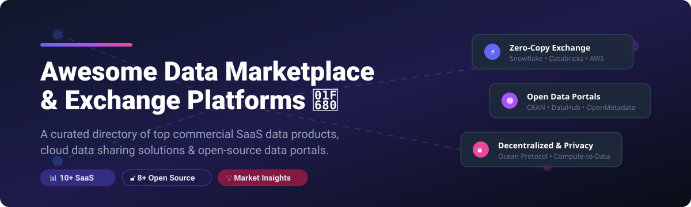
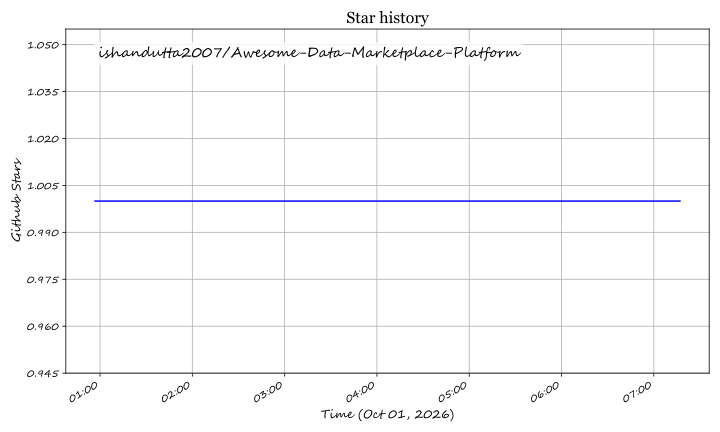

<!-- SEO Meta Description: A curated list of top Data Marketplace platforms, commercial SaaS data exchange software, open-source data portals, and zero-copy data sharing protocols. -->



<p center>
<a href="https://github.com/ishandutta2007/Awesome-Awesome-Awesome"></a><a href="https://discord.gg/jc4xtF58Ve"></a> <a href="https://github.com/ishandutta2007/Awesome-Data-Marketplace-Platform/stargazers"></a> <a href="https://github.com/ishandutta2007/Awesome-Data-Marketplace-Platform/network/members"></a> <a href="https://github.com/ishandutta2007/Awesome-Data-Marketplace-Platform/blob/main/LICENSE"></a> <a href="https://github.com/ishandutta2007/Awesome-Data-Marketplace-Platform/commits/main"></a> <a href="https://github.com/ishandutta2007"></a>
</p>

# 🌐 Awesome Data Marketplace Platform

> **Curated List of Commercial SaaS Data Products, Cloud Exchange Platforms & Open-Source Data Portals**  
> *Focused on Enterprise Data Sharing, Data Monetization, Open Data Portals, Zero-Copy Warehouses & Decentralized Data Markets.*

---

## 📌 Table of Contents
- [📊 SaaS & Hosted Data Marketplace Platforms](#-saas--hosted-data-marketplace-platforms)
- [🔓 Open-Source GitHub Projects](#-open-source-github-projects)
- [💡 Data Marketplace Frameworks & Architectural Patterns](#-data-marketplace-frameworks--architectural-patterns)
- [🤝 How to Contribute](#-how-to-contribute)
- [☕ Support & Sponsorship](#-support--sponsorship)
- [📈 Star History](#-star-history)
- [⚖️ Disclaimer](#%EF%B8%8F-disclaimer)

---

## 📊 SaaS & Hosted Data Marketplace Platforms

> **Estimated Market Size & Market Structure:** The global Data Marketplace and Exchange Market is estimated at **$3.8 Billion in 2026** and projected to reach **$14.2 Billion by 2032** (CAGR of ~24.5%). The market is **moderately fragmented**: cloud infrastructure hyperscalers (AWS, Snowflake, Databricks) dominate enterprise zero-copy warehouse sharing, while specialized data brokers (Dawex, LiveRamp, DataRade) and decentralized networks (Ocean Protocol) compete in domain-specific commercial datasets and privacy-preserving data exchanges.

The table below lists top commercial SaaS platforms sorted by **Company Size (Revenue / Valuation)** in descending order:

| Platform / SaaS Product | Description | Company Size (Rev / Valuation) 🔽 | Starting Price | Free Tier / Free Trial Limits |
| :--- | :--- | :--- | :--- | :--- |
| **[AWS Data Exchange](https://aws.amazon.com/data-exchange/)** | AWS marketplace for third-party datasets delivered directly into S3, Redshift, and AWS Clean Rooms with automated ETL ingestion. | ~$100B+ (AWS Rev) / ~$2.2T (Market Cap) | $0/mo base for free listings; paid datasets start at $100/mo or pay-per-GB query fees. | **AWS Free Tier** includes 12-month free usage tier across core services; free commercial data products available with $0 subscription fee. |
| **[Snowflake Marketplace](https://www.snowflake.com/en/data-cloud/marketplace/)** | Native data marketplace inside Snowflake Data Cloud for discovering and consuming live third-party datasets via zero-copy data sharing. | ~$3.8B Revenue / ~$45B Market Cap | Included in Snowflake capacity usage, starting at $2.00 per Snowflake Credit (Standard Edition). | **30-Day Free Trial** with $400 in free compute credits to query and evaluate marketplace data products. |
| **[Databricks Marketplace](https://www.databricks.com/product/marketplace)** | Open data marketplace integrated with Databricks Lakehouse, enabling sharing of tabular data, AI models, and notebooks via Delta Sharing. | ~$2.4B Revenue / ~$43B Valuation | Pay-as-you-go based on Databricks Compute Units (DBUs), starting at $0.07 per DBU-hour (Serverless). | **14-Day Free Trial** with full access to Lakehouse environment and sample commercial dataset trials. |
| **[LiveRamp Data Marketplace](https://liveramp.com/)** | Enterprise identity and customer data exchange platform focusing on privacy-safe data onboarding, activation, and data clean rooms. | ~$660M Revenue / ~$1.8B Market Cap | $1,500/month base platform license + data activation CPM fees starting from $0.10 per 1,000 audience records. | **14-Day Sandbox Access** for developer evaluation with mock dataset access (up to 10,000 test identity matches). |
| **[Dawex](https://www.dawex.com/)** | Turnkey data exchange platform enabling enterprise organizations to orchestrate, license, monetize, and exchange data under custom governance rules. | ~$15M Revenue / ~$60M Valuation | $1,800/month starting for Dawex Data Exchange Platform Starter enterprise license. | **30-Day Enterprise Evaluation** trial with pre-configured data exchange workspace and 5 user seats. |
| **[DataHub Marketplace (Acryl Data)](https://datahubproject.io/)** | Commercial managed catalog and metadata exchange ecosystem powered by Acryl Data for governance, lineage, and data product discovery. | ~$15M Revenue / ~$100M Valuation | $500/month starting for Acryl Data Managed Cloud Starter plan. | **14-Day Free Trial** for Acryl Cloud; core open-source DataHub is free forever under Apache 2.0. |
| **[DataRade](https://datarade.ai/)** | Global B2B commercial data marketplace aggregating dataset listings across 2,000+ data providers for corporate data buyers. | ~$6M Revenue / ~$25M Valuation | $299/month starting listing plan for commercial data vendors. | **Free Forever** buyer discovery account (unlimited search and supplier inquiries) & 14-day vendor listing trial. |
| **[Ocean Protocol](https://oceanprotocol.com/)** | Decentralized blockchain data exchange protocol and privacy-preserving compute-to-data marketplace for publishing and monetizing data. | ~$5M Ecosystem Treasury / ~$120M Token Market Cap | $0 base platform fee; ~$0.001 network gas fee per transaction on Polygon/Ocean Network + seller-defined asset price. | **Free Forever** open-source stack & public testnet access with unlimited free testnet tokens. |
| **[Nomad Data](https://www.nomad-data.com/)** | Specialized data marketplace and data procurement platform connecting institutional investors and enterprises with alternative datasets. | ~$3M Revenue / ~$15M Valuation | $499/month for Data Buyer Search & Procurement Subscription. | **7-Day Free Trial** allowing up to 3 custom alternative dataset procurement requests. |
| **[DataStreamX](https://www.datastreamx.com/)** | Data monetization engine enabling real-time IoT, telemetry, and transactional dataset listing, routing, and access licensing. | ~$2M Revenue / ~$100M Valuation | $350/month starter plan for data monetization and transaction routing. | **14-Day Free Trial** with demo API key and 1,000 test API calls limit. |

---

## 🔓 Open-Source GitHub Projects

The following curated open-source projects power modern data portals, metadata marketplaces, zero-copy data sharing, and decentralized data exchange protocols. Listed below sorted by **Stars_Count** in descending order:

1. **[OpenMetadata](https://github.com/open-metadata/OpenMetadata)** <a href="https://github.com/open-metadata/OpenMetadata/stargazers"></a>  
   Open-source data governance platform and metadata catalog providing data marketplace assets, column-level lineage, data quality checks, and unified discovery across enterprise data stacks.

2. **[DataHub](https://github.com/datahub-project/datahub)** <a href="https://github.com/datahub-project/datahub/stargazers"></a>  
   Extensible open-source data catalog and metadata platform enabling search, governance, automated lineage, and data product marketplace experiences.

3. **[CKAN](https://github.com/ckan/ckan)** <a href="https://github.com/ckan/ckan/stargazers"></a>  
   The world's leading open-source data portal platform for cataloging, publishing, and sharing open government, academic, and enterprise datasets.

4. **[Amundsen](https://github.com/amundsen-io/amundsen)** <a href="https://github.com/amundsen-io/amundsen/stargazers"></a>  
   Data discovery and metadata engine (originally built at Lyft) for indexing data assets, column statistics, and dataset ownership across data platforms.

5. **[Delta Sharing](https://github.com/delta-io/delta-sharing)** <a href="https://github.com/delta-io/delta-sharing/stargazers"></a>  
   Open protocol for secure zero-copy cross-organization data sharing across cloud data lakes, object storage, and data warehouses.

6. **[Frictionless Data Framework](https://github.com/frictionlessdata/framework)** <a href="https://github.com/frictionlessdata/framework/stargazers"></a>  
   Open specifications and Python/JS libraries for packaging, validating, and describing datasets for interoperable data exchange.

7. **[Magda](https://github.com/magda-io/magda)** <a href="https://github.com/magda-io/magda/stargazers"></a>  
   Cloud-native open data management platform and federated catalog search engine built for Kubernetes deployment and multi-tenant data access.

8. **[Ocean Market](https://github.com/oceanprotocol/market)** <a href="https://github.com/oceanprotocol/market/stargazers"></a>  
   Open-source reference marketplace web application built on Ocean Protocol for publishing, pricing, and exchanging Web3 data assets with compute-to-data privacy.

---

## 💡 Data Marketplace Frameworks & Architectural Patterns

When constructing custom enterprise data exchange platforms or open data portals, engineering teams combine modular components across the data lifecycle:

```
[ Data Source / Catalog ] ---> [ Open Data Portal / Metadata (CKAN / OpenMetadata) ] 
                                      │
                                      ▼
                      [ Sharing Protocol (Delta Sharing) ]
                                      │
                                      ▼
            [ Access Control & Monetization (Ocean Protocol / Dawex) ]
                                      │
                                      ▼
                   [ Consumer Data Warehouse / API Delivery ]
```

* **Open Data Publishing**: Use **CKAN** or **Magda** hosted on object storage for public and municipal dataset repositories.
* **Zero-Copy Data Exchange**: Leverage **Delta Sharing** or **Snowflake Direct Shares** for high-volume tabular dataset transfers without data duplication.
* **Privacy-Preserving & Monetized Exchange**: Layer **Ocean Protocol** for Web3 access control, tokenized pricing, and compute-to-data workflows where raw data remains protected.
* **Interoperable Metadata**: Standardize dataset manifests using **Frictionless Data Package** specifications to ensure platform-independent schema validation.

---

## 🤝 How to Contribute

Contributions are always welcome! Check out our contribution guide:

1. **Fork** this repository.
2. Add your suggested SaaS product or open-source repo in `README.md` maintaining proper table or star-badge format.
3. Check out the curated awesome lists collection at [Awesome-Awesome-Awesome](https://github.com/ishandutta2007/Awesome-Awesome-Awesome).
4. Create a Feature Branch (`git checkout -b feature/AddDataPlatform`).
5. Submit a Pull Request with a short description of the entry.

---

## ☕ Support & Sponsorship

If you find this repository helpful for your data product research or enterprise stack building, please consider supporting the project!

- ⭐️ **Star** this repository to help others discover it.
- 🔀 **Fork** and share with your data engineering team.
- 💖 **Sponsor / Buy me a coffee**: Support ongoing open-source maintenance via [GitHub Sponsors Dashboard](https://github.com/sponsors/ishandutta2007).

---

## 📈 Star History

[](https://star-history.dera.page/#ishandutta2007/Awesome-Data-Marketplace-Platform&type=date&legend=top-left)

---

## ⚖️ Disclaimer

- This is a **community-curated** educational directory — not exhaustive and not an official product endorsement.
- Acquiring, selling, and distributing datasets involves legal licensing, privacy compliance (GDPR, CCPA), and regulatory obligations. Open-source software and market listings do not substitute for formal legal review of commercial data licensing contracts.

## ⭐ Star History

<a href="https://star-history.com/#ishandutta2007/Awesome-Data-Marketplace-Platform&Timeline" align="center">
  <picture>
    <source media="(prefers-color-scheme: dark)" srcset="assets/ishandutta2007_Awesome-Data-Marketplace-Platform_growth.svg">
    
  </picture>
</a>
